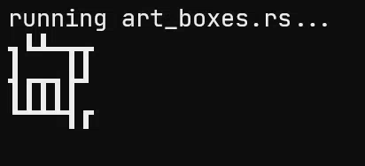

# massivebird's art_boxes



A procedural art generator in your terminal!

🦀 written in Rust

## Building

To manually build the project, you must first [install Rust](https://www.rust-lang.org/tools/install).

Once you have Rust installed, run the following commands:

```bash
git clone https://github.com/massivebird/art_boxes
cd art_boxes
cargo run -- <width> <height> # runs unoptimized build
```
